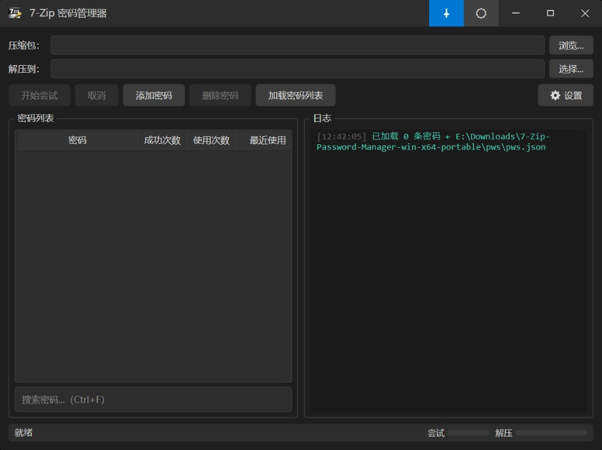

# 7-Zip Password Manager

轻量、便携、面向加密压缩包的密码管理与自动解压工具。

## 简介

7-Zip Password Manager 是一个面向加密压缩包的 Windows 桌面工具，主要用于解决“重复输入压缩包密码”和“手动反复试错”的问题。

程序不会修改 7-Zip 本体，而是通过调用本机 `7z.exe` 来完成密码测试与解压流程。

## 主要功能

- 管理历史密码（添加、删除、加载密码列表，支持搜索密码 Ctrl+F）
- 按多因素对候选密码排序：场景匹配、最近成功、成功率、手动优先
- 自动尝试历史密码，匹配成功后自动解压
- 记录成功 / 失败与使用次数，优化后续命中率
- 首次运行向导、设置（7-Zip 路径、密码文件、右键菜单、并行线程、界面语言）
- 亮/暗主题与窗口置顶
- 右键菜单「7ZPM - 智能解压」：在资源管理器中右键压缩包即可传入路径并打开本程序
- 支持便携式运行，解压即用

## 适用场景

适合以下情况：

- 经常处理带密码的 ZIP / 7Z / RAR 压缩包
- 同一来源的压缩包经常使用固定密码
- 不想每次都手动输入密码
- 希望使用本地离线、免安装的小工具

## 界面预览

## 运行要求

- Windows x64
- 可用的 `7z.exe`

发布版为自包含便携式，解压即可运行。7-Zip 可在首次运行向导或设置中自动检测或手动指定路径。

## 使用方法

1. 启动程序（或对压缩包使用右键「7ZPM - 智能解压」打开并传入路径）
2. 「压缩包」旁点击「浏览...」选择压缩包
3. 「解压到」旁点击「选择...」选择输出目录
4. 点击「开始尝试」
5. 程序按排序依次测试密码，成功后解压；可在设置中配置 7z.exe 与密码文件路径，使用「添加密码」「删除密码」「加载密码列表」管理密码

## 技术栈

- C#
- WPF
- .NET 8
- 本地 JSON 存储（界面文案来自 `config/gui.json`，支持多语言）
- 7-Zip 命令行调用
- 右键菜单集成

## 当前状态

项目仍在持续开发中，已具备首次向导、设置、右键菜单、多因素排序与日志等功能，后续重点包括：

- 完善密码管理
- 优化排序逻辑
- 改进便携式运行体验
- 整理项目结构与发布流程
